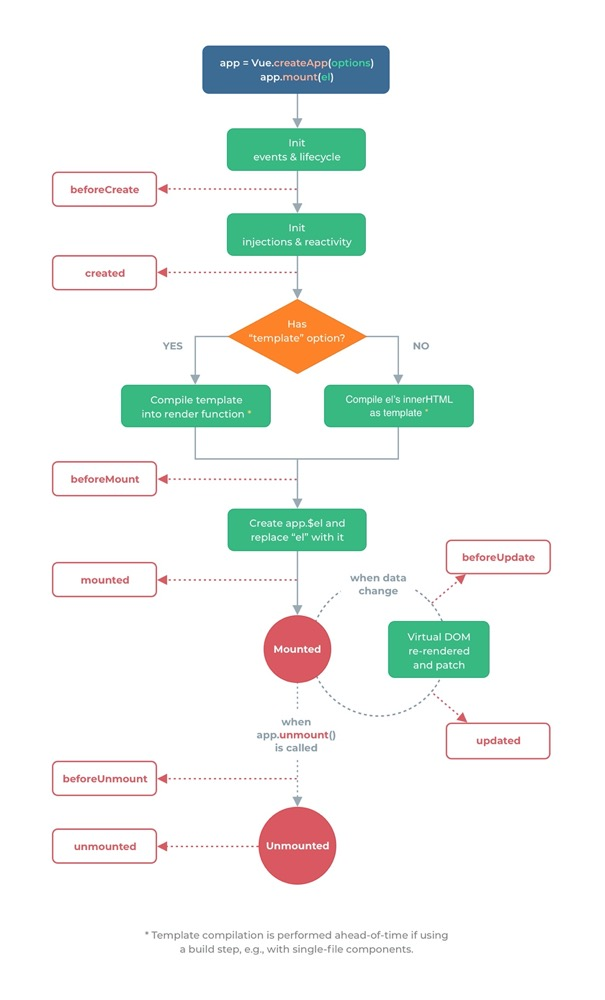

1. vue3 以前是实例，vue3 使用createApp

> vue2 使用类的实例

        var data = { a: 1 }

        // 该对象被加入到一个 Vue 实例中
        var vm = new Vue({
            data: data
        })

> vue3 使用createApp

        const app = Vue.createApp({
            data() {
                return { count: 4 }
            }
        })

const vm = app.mount('#app')

console.log(vm.count) // => 4

        或者

        import { createApp } from 'vue'
        import App from './App.vue'

createApp(App).mount('#app')

2. 声明周期与vue2 的不同

> vue2 生命周期

   

> vue3 生命周期

   