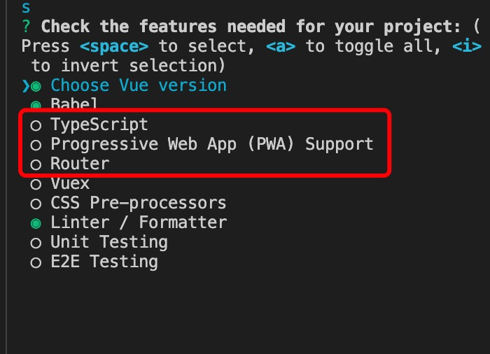

1. vue3 版本为 vue@next

        npm install vue@next

2. vue-cli

        npm install -g @vue/cli

        vue upgrade --next

3. @vue/cli 创建项目

+ create   vue create < projectName >

   

   

   

   

4. 项目目录结构

   

5. 多选项配置

   

   

   

   

   

   